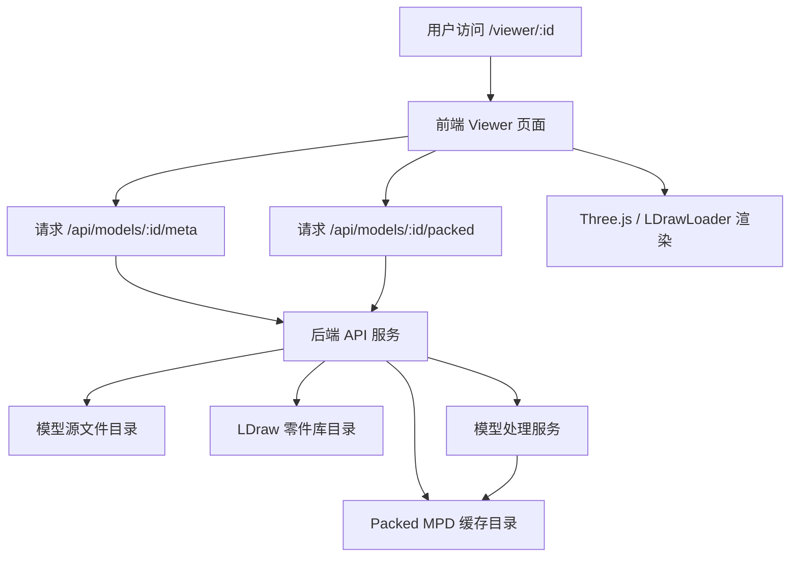
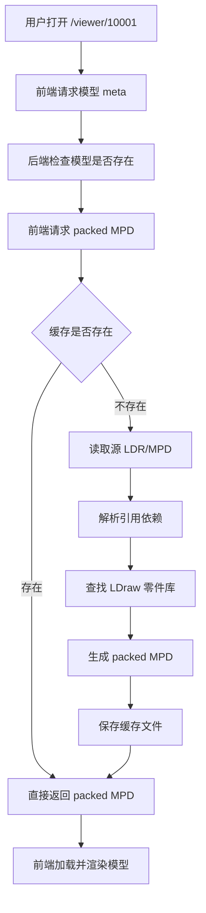
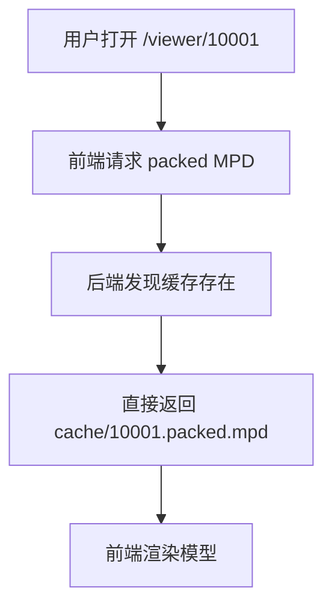
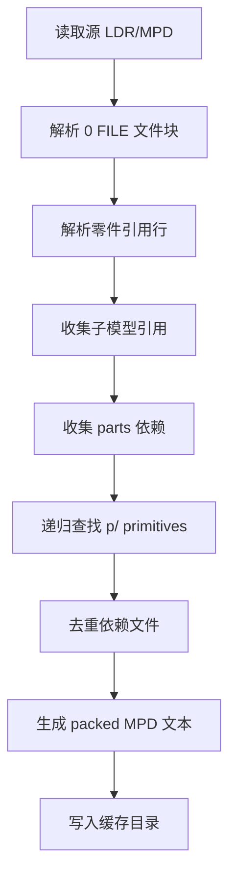
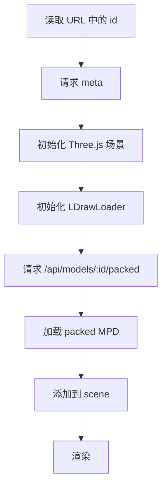
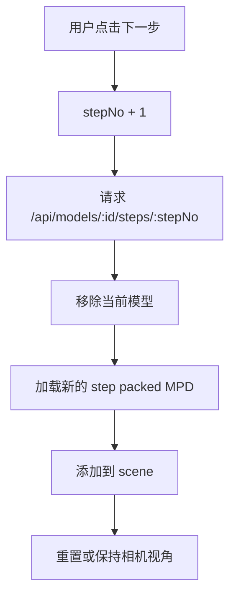

# 方案 2：Packed MPD 在线 LDR 浏览服务实现文档

## 1. 方案定位

本方案用于实现一个在线 LDR / MPD 拼搭图纸浏览服务。

用户通过模型 `id` 打开网页，系统从服务器本地磁盘读取 Studio 导出的 `.ldr` 或 `.mpd` 文件，后端预处理并生成浏览器更容易加载的 `packed MPD` 缓存文件，前端通过 Three.js / LDrawLoader 加载并渲染模型。

本方案适合正式给用户使用，相比直接加载原始 `.ldr` 文件，具有更好的加载稳定性、移动端体验和权限控制能力。

---

## 2. 核心目标

### 2.1 第一阶段目标

* 支持按模型 `id` 在线查看 LDR / MPD 模型。
* 模型源文件存储在服务器本地磁盘。
* 后端根据 `id` 查找源文件，不暴露真实文件路径。
* 后端将源文件和依赖资源打包为 `packed MPD`。
* 前端只加载一个打包后的 MPD 文件。
* 支持模型旋转、缩放、平移、重置视角。
* 支持基础错误提示和访问日志。
* 支持缓存，避免每次访问都重新打包。

### 2.2 第二阶段目标

* 支持解析 Studio 导出的步骤信息。
* 支持上一页 / 下一页分步浏览。
* 支持显示当前步骤编号。
* 支持每一步累计模型显示。
* 支持本步新增零件统计。
* 可选支持当前步骤新增零件高亮。

### 2.3 暂不实现的内容

第一版暂不实现：

* 不复刻 Studio 的 PDF 页面排版。
* 不复刻 Studio 的每页镜头视角。
* 不实现 callout 局部放大框。
* 不实现箭头安装提示。
* 不实现防截图、防录屏。
* 不做复杂订单系统，只预留 token 鉴权接口。

---

## 3. 适用前提

本方案假设用户的工作流程为：

```text
Studio 中设计模型
↓
Studio 中设置步骤 / 说明书顺序
↓
导出 LDR 或 MPD 文件
↓
将文件上传或放入服务器本地磁盘
↓
在线服务按 id 加载并展示
```

也就是说，在线系统不负责“重新设计说明书”，只负责读取 Studio 导出的结构并进行在线浏览。

---

## 4. 系统整体架构



---

## 5. 核心流程

### 5.1 首次访问流程



### 5.2 后续访问流程



---

## 6. 文件目录设计

推荐服务器目录结构：

```text
/data/ldr-viewer/
  source/
    10001.ldr
    10002.mpd
    10003.ldr

  ldraw-lib/
    LDConfig.ldr
    parts/
      3001.dat
      3002.dat
    p/
      4-4cyli.dat
    models/

  cache/
    packed/
      10001.v1.packed.mpd
      10002.v1.packed.mpd

    steps/
      10001/
        manifest.json
        step_001.packed.mpd
        step_002.packed.mpd
        step_003.packed.mpd

  logs/
    access.log
    process.log
    error.log
```

---

## 7. 数据库设计

第一版可以不强依赖数据库，用文件名直接对应 `id`。

如果需要后续扩展，建议增加 `models` 表。

### 7.1 models 表

```sql
CREATE TABLE models (
    id              VARCHAR(64) PRIMARY KEY,
    name            VARCHAR(255),
    source_file     VARCHAR(255) NOT NULL,
    source_type     VARCHAR(20),
    version         INT DEFAULT 1,
    status          VARCHAR(20) DEFAULT 'active',
    created_at      DATETIME,
    updated_at      DATETIME
);
```

### 7.2 字段说明

| 字段          | 说明                    |
| ----------- | --------------------- |
| id          | 模型 ID，对应访问 URL        |
| name        | 模型名称                  |
| source_file | 源文件名，例如 `10001.ldr`   |
| source_type | `ldr` 或 `mpd`         |
| version     | 文件版本，用于缓存失效           |
| status      | `active` / `disabled` |
| created_at  | 创建时间                  |
| updated_at  | 更新时间                  |

---

## 8. API 设计

## 8.1 前端页面

### 接口

```http
GET /viewer/:id
```

### 示例

```http
GET /viewer/10001
```

### 说明

返回前端 Viewer 页面。前端从 URL 中解析模型 ID，然后请求模型数据接口。

---

## 8.2 获取模型基础信息

### 接口

```http
GET /api/models/:id/meta
```

### 示例

```http
GET /api/models/10001/meta
```

### 成功响应

```json
{
  "id": "10001",
  "name": "步行炮台",
  "format": "mpd",
  "version": 1,
  "hasPackedCache": true,
  "hasSteps": true,
  "totalSteps": 42
}
```

### 失败响应

```json
{
  "code": 404,
  "message": "模型不存在"
}
```

---

## 8.3 获取完整 Packed MPD

### 接口

```http
GET /api/models/:id/packed
```

### 示例

```http
GET /api/models/10001/packed
```

### 说明

返回完整模型的 packed MPD 文件。

如果缓存存在，直接返回缓存文件。
如果缓存不存在，后端先生成缓存，再返回。

### 响应头

```http
Content-Type: text/plain; charset=utf-8
Cache-Control: private, max-age=3600
```

如果后续加入 token 鉴权，不建议设置为 `public` 缓存。

---

## 8.4 获取步骤清单

### 接口

```http
GET /api/models/:id/steps
```

### 示例

```http
GET /api/models/10001/steps
```

### 成功响应

```json
{
  "id": "10001",
  "name": "步行炮台",
  "totalSteps": 42,
  "steps": [
    {
      "step": 1,
      "partCount": 4,
      "newParts": [
        {
          "partId": "3001.dat",
          "color": "16",
          "count": 2
        },
        {
          "partId": "3020.dat",
          "color": "16",
          "count": 2
        }
      ]
    },
    {
      "step": 2,
      "partCount": 6,
      "newParts": [
        {
          "partId": "3710.dat",
          "color": "16",
          "count": 2
        }
      ]
    }
  ]
}
```

---

## 8.5 获取某一步 Packed MPD

### 接口

```http
GET /api/models/:id/steps/:stepNo
```

### 示例

```http
GET /api/models/10001/steps/12
```

### 说明

返回第 `stepNo` 步的累计模型 packed MPD。

第 12 步应该包含：

```text
第 1 步 + 第 2 步 + ... + 第 12 步
```

而不是只包含第 12 步新增零件。

### 失败响应

```json
{
  "code": 404,
  "message": "步骤不存在"
}
```

---

## 9. Packed MPD 生成策略

## 9.1 为什么要生成 Packed MPD

普通 `.ldr` 文件通常会引用外部零件文件：

```ldr
1 16 0 0 0 1 0 0 0 1 0 0 0 1 3001.dat
```

如果直接让前端加载原始 `.ldr`，浏览器还需要继续请求：

```text
/ldraw/parts/3001.dat
/ldraw/parts/3020.dat
/ldraw/p/xxx.dat
```

这会导致：

* 请求数量多。
* 移动端加载慢。
* 某个零件缺失时模型残缺。
* 出错定位困难。
* 权限控制分散。

Packed MPD 的思路是：

```text
主模型
+ 子模型
+ 依赖零件
+ 必要 primitives
= 一个打包后的 MPD 文件
```

前端只加载一个文件。

---

## 9.2 打包输入

输入文件可能是：

```text
/data/ldr-viewer/source/10001.ldr
/data/ldr-viewer/source/10002.mpd
```

源文件可能包含：

```ldr
0 FILE main.ldr
...
0 STEP
...
0 FILE submodel.ldr
...
0 STEP
...
```

也可能是普通单文件 LDR。

---

## 9.3 打包输出

完整模型缓存：

```text
/data/ldr-viewer/cache/packed/10001.v1.packed.mpd
```

分步缓存：

```text
/data/ldr-viewer/cache/steps/10001/step_001.packed.mpd
/data/ldr-viewer/cache/steps/10001/step_002.packed.mpd
/data/ldr-viewer/cache/steps/10001/step_003.packed.mpd
```

步骤描述文件：

```text
/data/ldr-viewer/cache/steps/10001/manifest.json
```

---

## 10. 打包处理流程

### 10.1 完整 Packed MPD 处理流程



### 10.2 依赖解析规则

LDraw 零件引用行一般以 `1` 开头：

```ldr
1 16 0 0 0 1 0 0 0 1 0 0 0 1 3001.dat
```

最后一列为引用文件名：

```text
3001.dat
```

处理时需要判断它是：

| 类型            | 示例               | 查找目录               |
| ------------- | ---------------- | ------------------ |
| 子模型           | `left_leg.ldr`   | 当前 MPD 文件块         |
| 零件            | `3001.dat`       | `ldraw-lib/parts/` |
| primitive     | `4-4cyli.dat`    | `ldraw-lib/p/`     |
| 子目录 primitive | `48/1-4edge.dat` | `ldraw-lib/p/48/`  |

---

## 11. 分步浏览生成策略

## 11.1 基础原则

Studio 已经设置好说明书步骤，因此后端不重新设计步骤，只读取文件中的：

```ldr
0 STEP
```

并按出现顺序生成步骤。

---

## 11.2 累计步骤生成

如果原始文件包含：

```ldr
0 FILE main.ldr
1 16 ... 3001.dat
0 STEP
1 16 ... 3020.dat
0 STEP
1 16 ... 3710.dat
0 STEP
```

应生成：

```text
step_001 = 第 1 步
step_002 = 第 1 步 + 第 2 步
step_003 = 第 1 步 + 第 2 步 + 第 3 步
```

用户查看第 3 步时，应看到已经拼好的累计模型。

---

## 11.3 本步新增零件统计

每一步应记录新增零件：

```json
{
  "step": 3,
  "newParts": [
    {
      "partId": "3710.dat",
      "color": "16",
      "count": 2
    }
  ]
}
```

统计规则：

同一步中相同 `partId + color` 的零件合并计数。

---

## 11.4 子模型处理策略

第一版建议采取简单策略：

```text
优先支持主模型线性步骤。
如果存在子模型，则将子模型作为完整引用处理。
```

也就是说：

* 主模型步骤按 `0 STEP` 切分。
* 子模型内部步骤可以先不单独展开。
* 当主模型某一步引用子模型时，子模型整体出现。

后续高级版本再支持：

```text
子模型单独分步
子模型完成后回到主模型
子模型安装到主体
```

---

## 12. 推荐实现方案

## 12.1 第一版推荐：每一步生成一个 packed MPD

第一版最稳、最容易实现的方式：

```text
完整模型：
10001.v1.packed.mpd

分步模型：
step_001.packed.mpd
step_002.packed.mpd
step_003.packed.mpd
```

前端每次点击下一步时，请求对应 step 文件。

优点：

* 实现简单。
* 后端逻辑清晰。
* 前端状态简单。
* 出错容易定位。

缺点：

* 每一步文件都可能较大。
* 切换步骤时需要重新加载模型。
* 步骤多时缓存占用较高。

适合第一版上线。

---

## 12.2 第二版优化：完整 packed MPD + step 映射表

后续可以优化为：

```text
前端一次加载完整 packed MPD
后端返回 step 映射表
前端根据 step 控制零件显隐
```

优点：

* 步骤切换更快。
* 网络请求更少。
* 用户体验更好。

缺点：

* 前端需要能识别每个零件属于第几步。
* 数据结构更复杂。
* 对 Three.js 模型对象管理要求更高。

第一版不建议直接做这个。

---

## 13. 后端核心模块设计

推荐后端拆成以下模块：

```text
src/
  api/
    model_api.py

  services/
    model_service.py
    pack_service.py
    step_service.py
    cache_service.py

  ldraw/
    parser.py
    dependency_resolver.py
    mpd_writer.py

  config.py
```

---

## 13.1 model_service

职责：

* 根据 id 查找模型。
* 校验模型是否存在。
* 返回源文件路径。
* 返回模型 meta 信息。

核心方法：

```python
get_model_meta(model_id)
get_source_path(model_id)
check_model_exists(model_id)
```

---

## 13.2 pack_service

职责：

* 生成完整 packed MPD。
* 判断缓存是否存在。
* 缓存不存在时触发打包。

核心方法：

```python
ensure_packed(model_id)
build_packed_mpd(source_path, output_path)
```

---

## 13.3 step_service

职责：

* 解析 `0 STEP`。
* 生成步骤 manifest。
* 生成每一步累计 packed MPD。

核心方法：

```python
ensure_steps(model_id)
parse_steps(source_path)
build_step_packed_files(model_id)
get_step_manifest(model_id)
get_step_file(model_id, step_no)
```

---

## 13.4 dependency_resolver

职责：

* 收集 LDraw 文件引用。
* 查找 parts / p / models。
* 递归查找 primitive 依赖。
* 去重。

核心方法：

```python
resolve_dependencies(source_file)
find_ldraw_file(file_name)
collect_part_refs(content)
```

---

## 14. 后端伪代码

## 14.1 获取完整 Packed MPD

```python
def get_packed_model(model_id: str):
    validate_model_id(model_id)

    source_path = model_service.get_source_path(model_id)
    if not source_path.exists():
        raise NotFound("模型不存在")

    cache_path = cache_service.get_packed_path(model_id)

    if not cache_path.exists() or cache_service.is_expired(model_id, cache_path):
        pack_service.build_packed_mpd(source_path, cache_path)

    return send_file(cache_path)
```

---

## 14.2 生成完整 Packed MPD

```python
def build_packed_mpd(source_path, output_path):
    source_content = read_text(source_path)

    mpd_blocks = parser.parse_mpd_blocks(source_content)

    references = parser.collect_references(source_content)

    dependencies = dependency_resolver.resolve_all(references)

    packed_content = mpd_writer.write(
        main_content=source_content,
        dependency_files=dependencies
    )

    write_text(output_path, packed_content)
```

---

## 14.3 获取步骤文件

```python
def get_step_model(model_id: str, step_no: int):
    validate_model_id(model_id)

    step_service.ensure_steps(model_id)

    step_file = cache_service.get_step_path(model_id, step_no)

    if not step_file.exists():
        raise NotFound("步骤不存在")

    return send_file(step_file)
```

---

## 14.4 生成步骤缓存

```python
def build_step_packed_files(model_id):
    source_path = model_service.get_source_path(model_id)
    source_content = read_text(source_path)

    steps = parser.split_by_step(source_content)

    accumulated_lines = []

    for index, step_lines in enumerate(steps):
        accumulated_lines.extend(step_lines)

        step_content = build_ldr_content(accumulated_lines)

        dependencies = dependency_resolver.resolve_all(
            parser.collect_references(step_content)
        )

        packed_content = mpd_writer.write(
            main_content=step_content,
            dependency_files=dependencies
        )

        output_path = cache_service.get_step_path(model_id, index + 1)
        write_text(output_path, packed_content)
```

---

## 15. 前端实现设计

## 15.1 前端页面结构

```text
Viewer 页面
  顶部：模型名称
  中间：3D 渲染区域
  底部：操作栏
    - 上一步
    - 当前步骤 / 总步骤
    - 下一步
    - 重置视角
    - 全屏
```

---

## 15.2 前端加载完整模型流程



---

## 15.3 前端加载步骤流程



---

## 15.4 前端伪代码

```js
let currentModel = null;
let currentStep = 1;
let totalSteps = 0;

async function loadMeta(modelId) {
  const res = await fetch(`/api/models/${modelId}/meta`);
  return await res.json();
}

async function loadPackedModel(modelId) {
  clearCurrentModel();

  loader.load(`/api/models/${modelId}/packed`, function (model) {
    currentModel = model;
    scene.add(model);
    fitCameraToObject(model);
    render();
  });
}

async function loadStep(modelId, stepNo) {
  clearCurrentModel();

  loader.load(`/api/models/${modelId}/steps/${stepNo}`, function (model) {
    currentModel = model;
    scene.add(model);
    fitCameraToObject(model);
    render();
  });
}

function clearCurrentModel() {
  if (currentModel) {
    scene.remove(currentModel);
    currentModel = null;
  }
}

function nextStep() {
  if (currentStep < totalSteps) {
    currentStep += 1;
    loadStep(modelId, currentStep);
  }
}

function prevStep() {
  if (currentStep > 1) {
    currentStep -= 1;
    loadStep(modelId, currentStep);
  }
}
```

---

## 16. 缓存策略

## 16.1 缓存命名

完整 packed 文件：

```text
{modelId}.v{version}.packed.mpd
```

示例：

```text
10001.v1.packed.mpd
10001.v2.packed.mpd
```

步骤文件：

```text
step_001.packed.mpd
step_002.packed.mpd
```

---

## 16.2 缓存失效

以下情况需要重新生成缓存：

* 源 `.ldr` / `.mpd` 文件被替换。
* 模型版本号变更。
* LDraw 零件库更新。
* 打包脚本版本更新。
* 手动触发刷新缓存。

建议提供后台接口：

```http
POST /api/admin/models/:id/rebuild
```

用于手动重建缓存。

---

## 16.3 懒生成与预生成

### 懒生成

用户第一次访问时生成缓存。

优点：

* 后台流程简单。
* 不需要提前处理所有模型。

缺点：

* 第一次访问可能较慢。

### 预生成

管理员上传模型后立即生成缓存。

优点：

* 用户访问速度快。
* 可以提前发现文件问题。

缺点：

* 上传流程复杂一些。

### 推荐

正式使用推荐：

```text
上传后预生成
访问时兜底懒生成
```

---

## 17. 错误处理

## 17.1 源文件不存在

后端返回：

```json
{
  "code": 404,
  "message": "模型文件不存在"
}
```

前端提示：

```text
图纸不存在，请确认链接是否正确。
```

---

## 17.2 依赖零件缺失

后端打包时发现缺少零件：

```json
{
  "code": 500,
  "message": "模型依赖零件缺失"
}
```

日志记录：

```text
modelId=10001 missingPart=3001.dat
```

前端提示：

```text
图纸文件不完整，请联系店铺客服处理。
```

---

## 17.3 文件格式错误

后端返回：

```json
{
  "code": 500,
  "message": "图纸文件解析失败"
}
```

前端提示：

```text
图纸解析失败，请联系店铺客服处理。
```

---

## 17.4 步骤不存在

后端返回：

```json
{
  "code": 404,
  "message": "步骤不存在"
}
```

前端提示：

```text
当前步骤不存在。
```

---

## 18. 安全设计

## 18.1 ID 校验

只允许合法模型 ID：

```text
10001
abc_10001
```

不允许：

```text
../../etc/passwd
10001/../../
```

推荐第一版只允许数字：

```regex
^\d+$
```

---

## 18.2 不暴露真实路径

禁止返回：

```text
/data/ldr-viewer/source/10001.ldr
```

只返回：

```text
/api/models/10001/packed
```

---

## 18.3 禁止目录浏览

Nginx 禁止：

```nginx
autoindex on;
```

---

## 18.4 源文件不直接公开

不要开放：

```text
/source/10001.ldr
```

用户只能访问后端处理后的接口：

```text
/api/models/10001/packed
/api/models/10001/steps/1
```

---

## 18.5 Token 鉴权预留

后续可以使用：

```text
/viewer/10001?token=xxxx
```

接口也带 token：

```http
GET /api/models/10001/packed?token=xxxx
```

后端校验：

* token 是否有效。
* token 是否绑定模型 id。
* token 是否过期。
* token 是否绑定订单或用户。

---

## 19. Nginx 部署设计

如果使用方案 2，理论上不需要把完整 LDraw 零件库暴露给前端。

Nginx 只需要暴露前端页面和 API。

```nginx
server {
    listen 80;
    server_name ldr.example.com;

    root /var/www/ldr-viewer;

    location / {
        try_files $uri /index.html;
    }

    location /api/ {
        proxy_pass http://127.0.0.1:8000/;
        proxy_set_header Host $host;
        proxy_set_header X-Real-IP $remote_addr;
    }
}
```

如果调试阶段需要直接访问零件库，可以临时增加：

```nginx
location /ldraw/ {
    alias /data/ldr-viewer/ldraw-lib/;
    expires 30d;
    add_header Cache-Control "public";
}
```

正式环境建议关闭或限制访问。

---

## 20. 部署建议

推荐部署组件：

```text
Nginx
FastAPI / Node.js API 服务
前端静态页面
本地磁盘模型目录
本地磁盘缓存目录
LDraw 零件库目录
```

推荐第一版技术栈：

```text
前端：Vite + Three.js
后端：FastAPI
进程管理：systemd / supervisor / pm2
反向代理：Nginx
```

---

## 21. 验收标准

第一版完整模型浏览验收：

1. 访问 `/viewer/10001` 能打开模型浏览页面。
2. 前端能请求 `/api/models/10001/meta`。
3. 前端能请求 `/api/models/10001/packed`。
4. 后端能在缓存不存在时自动生成 packed MPD。
5. 后端能在缓存存在时直接返回缓存文件。
6. 浏览器能正常显示 3D 模型。
7. 用户可以旋转、缩放、平移模型。
8. 用户可以重置视角。
9. 模型不存在时页面有明确提示。
10. 后端不会暴露服务器真实路径。
11. 用户无法通过 URL 读取任意本地文件。

第二阶段分步浏览验收：

1. 后端能解析 `0 STEP`。
2. 后端能生成 `manifest.json`。
3. 前端能显示 `第 n / total 步`。
4. 用户可以点击上一页 / 下一页。
5. 每一步显示累计模型，而不是只显示新增零件。
6. 当前步骤不存在时页面有明确提示。
7. 后端能记录缺失零件或解析失败日志。

---

## 22. 推荐开发顺序

### 阶段 1：完整模型浏览

```text
1. 搭建前端 Viewer 页面
2. 搭建后端 API
3. 实现 /api/models/:id/meta
4. 实现 /api/models/:id/packed
5. 实现 packed MPD 生成
6. 实现缓存读取
7. 前端加载 packed MPD 并渲染
```

### 阶段 2：分步浏览

```text
1. 解析源文件中的 0 STEP
2. 生成步骤 manifest
3. 生成每一步累计 packed MPD
4. 实现 /api/models/:id/steps
5. 实现 /api/models/:id/steps/:stepNo
6. 前端增加上一页 / 下一页
7. 前端显示当前步骤编号
```

### 阶段 3：体验优化

```text
1. 本步新增零件统计
2. 当前步骤新增零件高亮
3. 加载动画
4. 移动端按钮优化
5. 全屏模式
6. token 鉴权
```

### 阶段 4：正式交付优化

```text
1. 上传后自动预生成缓存
2. 缓存重建后台接口
3. 访问日志
4. 错误告警
5. 订单 token 绑定
6. PDF / 图片说明书入口
```

---

## 23. 总结

方案 2 的核心思路是：

```text
源 LDR / MPD 文件不直接给前端
后端先处理成 packed MPD
前端只加载 packed MPD
```

它相比方案 1 的主要优势是：

```text
加载更稳定
请求更少
移动端体验更好
权限控制更集中
更适合作为正式商品交付
```

结合当前工作流，最推荐的落地方式是：

```text
Studio 负责设计模型和步骤
后端负责打包与缓存
前端负责在线 3D 浏览和分步播放
PDF / PNG 说明书作为正式拼搭主入口
3D 分步浏览作为辅助查看入口
```

第一版不需要追求完全复刻 Studio 说明书页面，只需要稳定实现：

```text
按 id 打开
加载 packed MPD
3D 查看
分步上一页 / 下一页
```

后续再逐步补充高亮、零件清单、token 鉴权和订单绑定。
